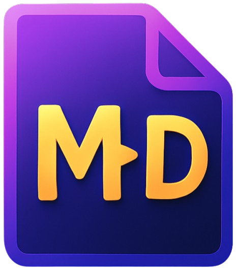

  
  <h1>mdppt - Markdown Presenter</h1>

🚀 Transform your markdown files into presentations instantly!

A powerful, client-side markdown to presentation converter that runs entirely in your browser. No uploads, no servers - just beautiful presentations from your markdown files.

## 🎥 Demo Video

📺 See mdppt in action! Watch our demo video to learn how to create presentations in minutes:

[▶️ **Watch Demo Video**](https://github.com/user-attachments/assets/344f9ac3-7087-41e5-89a9-57ecb39e40a6)

## ✨ Key Features

- 📝 Simple Markdown Syntax - Write presentations like documentation
- 🎯 Presenter Mode - Professional presentation experience with keyboard shortcuts
- 🔴 Laser Pointer - Highlight important points during presentations
- ✨ Text Highlighting - Multi-selection highlighting for emphasis
- 🖼️ Image Support - Local and online images with drag-and-drop
- 🔒 100% Private - All processing happens in your browser
- ⚡ Fast & Lightweight - No installation required

## 🎯 Perfect For

- Software developers and technical writers
- Educators and trainers
- Business professionals
- Students and researchers
- Anyone who prefers markdown over PowerPoint

## 🚀 Quick Start Options

### Option 1: Online Version

1. Create a .md file with your content
2. Visit [mdppt.netlify.app](https://mdppt.netlify.app/)
3. Drag & drop your markdown file
4. Press `P` to start presenting!

### Option 2: Local Version (Recommended for images heavy presentations)

1. Download `index-local.html` from this repository
2. Place the file in the same folder as your markdown file and images
3. Search for `fetch()` in the file and change the path to your markdown file.
4. Open the folder in VS Code
5. Start Live Server extension in VS Code
6. Open `index-local.html` in your browser
7. Enjoy completely local presentations with full image support!

Perfect for presentations with local images or offline environments.

## Live Demo: [mdppt.netlify.app](https://mdppt.netlify.app/)
